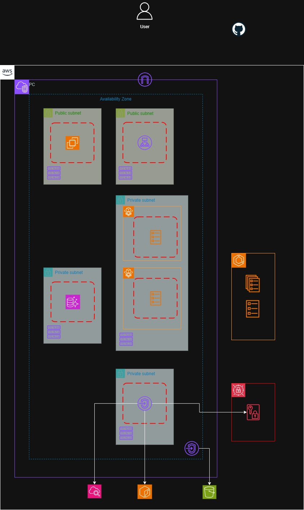

# AWS Webアプリケーション基盤

AWS上にWebアプリケーションを構築することを想定し、**可用性・スケーラビリティ・セキュリティ・運用性**を重視して設計したAWSインフラ構成です。

以下のビジネス要件から各AWSサービスの採用理由と設計方針を決定しています。

---

## 1. プロジェクト概要

### 目的

WebアプリケーションをAWS上に構築し、通常時の安定したAPI処理に加えて、予測困難なトラフィック増加やAZ障害に対しても継続的にサービスを提供できる基盤を構築する。なお、アプリケーション層は動作検証用のモックとして実装する。

### 想定アプリケーション

* Webアプリケーション
* ECS/Fargate上でコンテナアプリケーションを実行
* Aurora Serverless v2をデータベースとして利用
* シングルリージョン、マルチAZ構成
---



---

---

### 2. ビジネス要件

| 項目        | 要件                      |
| --------- | ----------------------- |
| システム      | Webアプリケーション             |
| 通常時トラフィック | 約10 req/sec             |
| 夜間トラフィック  | 日中の約1/3（約3 req/sec）     |
| トラフィック特性  | 変動が激しく、事前予測が困難          |
| 可用性       | マルチAZ構成                 |
| 障害時       | AZ障害発生時もサービス継続          |
| 性能        | 障害発生時も可能な限り通常時と同等の性能を維持 |
| セキュリティ    | アプリケーション・DB・認証情報を分離して保護 |
| 運用        | ログ・メトリクスを一元管理           |

---

### 3. インフラストラクチャコード

Infrastructure as CodeとしてTerraformによる構築を想定する。

```text
Terraform
    │
    ├── VPC
    ├── Subnet
    ├── Route Table
    ├── Security Group
    ├── ALB
    ├── ECS
    ├── Fargate
    ├── Aurora
    ├── Secrets Manager
    ├── VPC Endpoint
    └── IAM
```

TerraformによってAWSリソースをコード化し、環境差分を管理可能にする。

---

### 4. 設計成果物

```text
docs/
└── adr/
    ├── architecture.md
    ├── network-design.md
    ├── security-design.md
    ├── scaling-design.md
    ├── monitoring-design.md
    ├── cicd-design.md
    └── disaster-recovery.md 
```

---
### 5.技術スタック

#### コンテナオーケストレーション
- **AWS ECS Fargate**  
  コンテナのサーバレス実行基盤として採用。EC2 管理不要でスケーラブルな運用を実現。
- **Application Load Balancer (ALB)**  
  ECS サービスのトラフィックルーティングとヘルスチェックを担当。
- **Amazon ECR**  
  コンテナイメージのレジストリとして利用。
- **AWS VPC / Subnet / Security Group**  
  ネットワーク分離とセキュリティ制御。

#### IaC（Infrastructure as Code）
- **Terraform**  
  ECS / ALB / VPC / IAM / ECR などの構成管理をコード化。  
  `modules/` 配下でモジュール化し、`environments/` で環境別に管理。

#### コンテナ / アプリケーション
- **Docker / Docker Compose**  
  ローカル開発環境の構築とコンテナ化。
- **Python (FastAPI)**  
  Backend / Frontend のサンプルアプリケーション。
- **requirements.txt**  
  Python ライブラリの依存管理。

### 6.セットアップ方法

本アプリケーションのデプロイ方法は、GitHub Actionsで統一する。

---