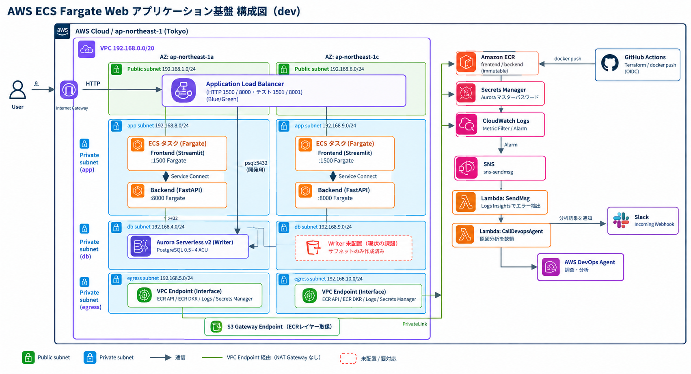

# AWS Webアプリケーション基盤

AWS上にWebアプリケーションを構築することを想定し、**可用性・スケーラビリティ・セキュリティ・運用性**を重視して設計したAWSインフラ構成です。

以下のビジネス要件から各AWSサービスの採用理由と設計方針を決定しています。

---

## 1. プロジェクト概要

### 目的

Webアプリケーションを AWS 上に構築し、通常時の安定した API 処理に加えて、予測困難なトラフィック増加や AZ 障害に対しても継続的にサービスを提供できる基盤を構築する。なお、アプリケーション層は動作検証用のモックとして実装する。

### 想定アプリケーション

* Webアプリケーション（メモ管理アプリ: Frontend + Backend API）
* ECS/Fargate 上でコンテナアプリケーションを実行
* Aurora Serverless v2（PostgreSQL互換）をデータベースとして利用
* シングルリージョン（ap-northeast-1）、マルチAZ構成

---



---

## 2. ビジネス要件

| 項目 | 要件 |
| --- | --- |
| システム | Webアプリケーション |
| 通常時トラフィック | 約10 req/sec |
| 夜間トラフィック | 日中の約1/3（約3 req/sec） |
| トラフィック特性 | 変動が激しく、事前予測が困難 |
| 可用性 | マルチAZ構成 |
| 障害時 | AZ障害発生時もサービス継続 |
| 性能 | 障害発生時も可能な限り通常時と同等の性能を維持 |
| セキュリティ | アプリケーション・DB・認証情報を分離して保護 |
| 運用 | ログ・メトリクスを一元管理 |

---

## 3. インフラストラクチャコード

Infrastructure as CodeとしてTerraformによる構築を行う。

```text
Terraform
    │
    ├── VPC
    ├── Subnet
    ├── Route Table
    ├── Security Group
    ├── ALB
    ├── ECS
    ├── Fargate
    ├── Aurora
    ├── Secrets Manager
    ├── VPC Endpoint
    ├── IAM
    ├── CloudWatch (Logs / Metric Filter / Alarm)
    ├── SNS
    └── Lambda
```

Terraformによってリソースをコード化し、`modules/` のモジュール化と `environments/` の環境別ディレクトリで環境差分を管理可能にする。

### ディレクトリ構成

```text
.
├── .github/workflows/        # CI/CD (GitHub Actions)
│   ├── deploy-all.yml        #   インフラ + イメージ + ECS を一括デプロイ
│   ├── deploy-infra.yml      #   インフラのみデプロイ
│   ├── taskdef-push.yml      #   イメージ push + タスク定義更新
│   └── destroy.yml           #   全リソース削除
├── docker/
│   ├── docker-compose.yml    #   ローカル開発用
│   ├── sample-dev-backend/   #   FastAPI (port 8000)
│   └── sample-dev-frontend/  #   Streamlit (port 1500)
├── environments/
│   ├── dev/                  #   開発環境 (tfstate: S3)
│   ├── stg/                  #   ステージング環境（未整備）
│   └── prd/                  #   本番環境（未整備）
├── modules/
│   ├── vpc/                  #   VPC / Subnet / SG / VPC Endpoint
│   ├── alb/                  #   ALB / Target Group / Listener (Blue/Green)
│   ├── ecs/                  #   Cluster / Service / Task Definition
│   ├── ecr/                  #   ECR リポジトリ
│   ├── aurora/               #   Aurora Serverless v2
│   ├── iam/                  #   IAM ロール / ポリシー
│   ├── ec2/                  #   開発端末 (SSM 接続)
│   ├── cloudwatch/           #   メトリクスフィルタ / アラーム
│   ├── sns/                  #   通知トピック
│   └── lambda/               #   SendMsg / CallDevopsAgent
└── docs/
    ├── adr/                  #   設計判断記録
    └── picture/              #   構成図
```

---

## 4. 設計成果物

設計や構築作業にあたって、詰まったところや、その背景を ADR や Issue などにまとめました。

### ADR

```text
docs/
 └── adr/
     ├── 001-adopt-ecs-fargate-terraform-cicd.md
     ├── 002-cloudwatch-logs-vpc-endpoint.md
     ├── 003-database-secrets-manager-and-db-endpoint.md
     ├── 004-staged-terraform-apply-for-initial-deploy.md
     ├── 005-container-communication-endpoint-resolution.md
     ├── 006-log-error-detection-architecture.md
     ├── 007-service-connect-name-resolution.md
     ├── 008-backend-deployment-strategy.md
     └── 009-maintenance-page.md
```

### Issue

| Issue | 概要 |
|---|---|
| [#1](https://github.com/kazuhisa2685/aws-ecs-fargate-sample-app/issues/1) | フロントエンド ECS からバックエンド ECS に接続できない問題 |
| [#2](https://github.com/kazuhisa2685/aws-ecs-fargate-sample-app/issues/2) | ECS のログが CloudWatch Logs に表示されない問題 |
| [#3](https://github.com/kazuhisa2685/aws-ecs-fargate-sample-app/issues/3) | バックエンド ECS から Aurora に接続できない問題 |
| [#4](https://github.com/kazuhisa2685/aws-ecs-fargate-sample-app/issues/4) | 初回デプロイ時、ECR にイメージがなくタスク定義が失敗する問題。`-target` による段階的な apply で暫定対応し、恒久対策を検討中（Open） |
| [#5](https://github.com/kazuhisa2685/aws-ecs-fargate-sample-app/issues/5) | Git で一度 push した大文字のフォルダ名を、小文字に変更できない問題 |
| [#6](https://github.com/kazuhisa2685/aws-ecs-fargate-sample-app/issues/6) | ALB 経由でアクセスできない問題 |
| [#7](https://github.com/kazuhisa2685/aws-ecs-fargate-sample-app/issues/7) | 初回デプロイ時のみフロントからバックエンドに接続できない問題。Service Connect の名前解決前にフロントが起動していたことが原因で、サービス安定化を待つ処理を追加 |
| [#10](https://github.com/kazuhisa2685/aws-ecs-fargate-sample-app/issues/10) | CI が静的アクセスキーを使用していた問題。OIDC 認証に変更 |
---

## 5. ネットワーク設計

VPC（`192.168.0.0/20`）を2AZ（1a / 1c）に分け、役割ごとにサブネットを分離する。

| サブネット | 種別 | 配置するリソース | CIDR (1a / 1c) |
| --- | --- | --- | --- |
| ingress | Public | ALB | 192.168.1.0/24 / 192.168.6.0/24 |
| mgmt | Public | 開発端末 (EC2, SSM接続) | 192.168.2.0/24 / 192.168.7.0/24 |
| app | Private | ECS Fargate (Frontend / Backend) | 192.168.3.0/24 / 192.168.8.0/24 |
| db | Private | Aurora | 192.168.4.0/24 / 192.168.9.0/24 |
| egress | Private | VPC Endpoint (Interface型) | 192.168.5.0/24 / 192.168.10.0/24 |

NAT Gateway は使用せず、VPC Endpoint 経由で AWS サービスへ接続する。

| VPC Endpoint | 種別 | 用途 |
| --- | --- | --- |
| S3 | Gateway | ECR イメージレイヤーの取得 |
| ECR API / ECR DKR | Interface | イメージの pull |
| CloudWatch Logs | Interface | コンテナログの送信 |
| Secrets Manager | Interface | DB パスワードの取得 |

### セキュリティグループの通信経路

```text
Internet ──(1500/1501)──▶ ALB ──(1500/1501)──▶ Frontend (Fargate)
                           │                          │
                           │                   Service Connect
                           │                    (backend-service:8000)
                           └──(8000/8001 ヘルスチェック)──▶ Backend (Fargate) ──(5432)──▶ Aurora
```

---

## 6. 技術スタック

### コンテナオーケストレーション

* **AWS ECS Fargate**
  コンテナのサーバレス実行基盤として採用。EC2 管理不要でスケーラブルな運用を実現。
* **Application Load Balancer (ALB)**
  ECS サービスのトラフィックルーティングとヘルスチェックを担当。Blue/Green 用に本番・テストの2リスナーを持つ。
* **ECS Service Connect**
  Frontend から Backend への名前解決（`backend-service`）とサービス間通信に利用。
* **Amazon ECR**
  コンテナイメージのレジストリ（タグ immutable、push 時スキャン有効）。
* **AWS VPC / Subnet / Security Group**
  ネットワーク分離とセキュリティ制御。

### データベース

* **Aurora Serverless v2 (PostgreSQL)**
  負荷変動に応じて 0.5〜4 ACU で自動スケール。マスターパスワードは Secrets Manager で自動管理。

### デプロイ

* **ECS 標準 Blue/Green**
  新バージョンを別ターゲットグループで起動し、テストリスナーで検証後に本番へ切り替える。サーキットブレーカーによる自動ロールバックを有効化。詳細は [ADR-008](docs/adr/008-backend-deployment-strategy.md) を参照。

### 監視・運用

* **CloudWatch Logs / Metric Filter / Alarm**
  コンテナログからエラーを検知。
* **SNS → Lambda (SendMsg) → Lambda (CallDevopsAgent) → Slack**
  アラーム発生時に Logs Insights でエラーログを抽出し、AWS DevOps Agent による原因分析結果を Slack へ通知。詳細は [ADR-006](docs/adr/006-log-error-detection-architecture.md) を参照。

### IaC（Infrastructure as Code）

* **Terraform (>= 1.10) / AWS Provider (~> 6.0)**
  `modules/` 配下でモジュール化し、`environments/` で環境別に管理。tfstate は S3（`use_lockfile`）で管理。

### コンテナ / アプリケーション

* **Docker / Docker Compose**
  ローカル開発環境の構築とコンテナ化。
* **Python (FastAPI)** … Backend（メモ CRUD API）
* **Python (Streamlit)** … Frontend（メモ管理画面）
* **requirements.txt**
  Python ライブラリの依存管理。

---

## 7. セットアップ方法

本アプリケーションのデプロイ方法は、GitHub Actionsで統一する。

### 事前準備

| 項目 | 内容 |
| --- | --- |
| tfstate 用 S3 バケット | `environments/dev/main.tf` の `backend "s3"` に指定したバケットを作成しておく |
| GitHub Secrets | `AWS_IAM_ROLE_ARN`（GitHub Actions が OIDC で引き受ける IAM ロール） |
| SSM Parameter Store | `/devops-agent/devops_agent_space_id`（DevOps Agent のスペースID）、`/devops-agent/slack_webhook_url`（Slack Webhook URL） |

### ワークフロー

| ワークフロー | 用途 | 実行方法 |
| --- | --- | --- |
| `deploy-all.yml` | 初回構築。基礎インフラ → イメージ push → タスク定義 → Backend → Frontend → 監視 の順に段階的にデプロイ | 手動 (workflow_dispatch) |
| `deploy-infra.yml` | ECS 以外のインフラのみ更新 | 手動 |
| `taskdef-push.yml` | アプリ更新時にイメージを build/push し、タスク定義を更新 | 手動 |
| `destroy.yml` | 全リソースの削除 | 手動 |

段階的にデプロイする理由（ECR にイメージが存在しないとタスク定義が作れない等）は [ADR-004](docs/adr/004-staged-terraform-apply-for-initial-deploy.md) を参照。

### ローカル開発

```bash
cd docker
docker compose up --build
```

| サービス | URL |
| --- | --- |
| Frontend | http://localhost:1500 |
| Backend (API) | http://localhost:8000/docs |

---

## 8. 既知の課題

設計上の改善点を以下に記録する。

| 重大度 | 内容 |
| --- | --- |
| 高 | Aurora が1インスタンス構成のため、AZ障害時は新インスタンス作成待ちになる（要件との乖離） |
| 高 | テストリスナー（1501 / 8001）が `0.0.0.0/0` に開放されている |
| 中 | Backend の `/health` が DB に依存しており、DB 障害時に全タスクが unhealthy になる |
| 中 | `stg` / `prd` 環境が未整備 |
| 低 | ALB が HTTP のみ（HTTPS 未対応） |
